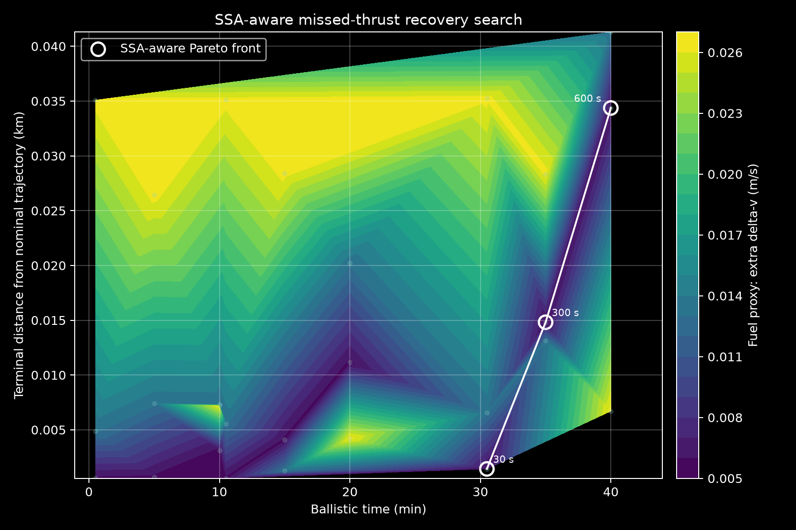

# SSA Missed-Thrust Event Impact and Recovery Assessment

Portfolio project for space domain awareness (SDA/SSA), low-thrust LEO operations, and conjunction-aware recovery planning.

This repository turns Adhi Saxena's Colab prototype into a reproducible Python package and command-line workflow. It models a missed-thrust event on an operator spacecraft, searches candidate recovery trajectories in the local RTN frame, and screens the recovery options against a nearby CelesTrak-derived catalog using SGP4 miss-distance metrics.



## Why this matters

Missed thrust is operationally awkward because the recovery maneuver is not only an astrodynamics problem. A recovery that returns the spacecraft to its nominal path can still create an avoidable conjunction geometry while it is catching up. This project treats recovery as an SSA decision product:

- fetch the operator TLE and active GP catalog from CelesTrak
- build a local catalog around the operator using orbital-element gates
- propagate nearby objects with SGP4 and rank baseline miss distances
- simulate missed-thrust impact in an operator-centric RTN frame
- generate recovery candidates with an Adhi Phase Guess heuristic
- score selected candidates against nearby objects for new-close-approach and risk-proxy metrics
- export reviewer-friendly CSVs, a summary JSON file, and an SSA-aware Pareto plot

The default run is intentionally small enough for a hiring reviewer to execute quickly. A broader `--full` mode is included for the larger notebook-style demonstration.

## Quick Start

```bash
python -m pip install -e ".[dev]"
ssa-mte run --catalog-size 40 --eval-objects 25
pytest
```

Outputs are written to `outputs/`:

- `local_catalog_screened.csv`: local catalog with TLE lines and baseline SGP4 miss-distance ranking
- `operator_trajectory.csv`: propagated operator state and derived geometry
- `phase_guess_search_space.csv`: recovery search space across outage, coast, and recovery horizon grids
- `ssa_selected_candidates.csv`: Pareto-selected candidates with SSA metrics
- `ssa_aware_pareto.png`: plot of terminal error, ballistic time, fuel proxy, and SSA-aware Pareto overlay
- `run_summary.json`: compact run metadata and best-candidate summary

A compact sample run is committed in `examples/sample_run/` so the results can be inspected before rerunning the live CelesTrak workflow.

## Full Demonstration

```bash
ssa-mte run --full
```

The full mode uses the notebook-scale grid:

- missed-thrust durations: `10, 30, 60, 300, 600, 1800` seconds
- ballistic delay grid: `0, 5, 10, 15, 30, 45` minutes
- recovery horizon grid: `15, 25, 35, 50, 70, 90` minutes
- SSA evaluation catalog: top 300 screened objects

This may take several minutes because it fetches many individual TLE records and repeatedly propagates SGP4 states.

## Method

### 1. Catalog Ingest

The pipeline queries CelesTrak GP data for the operator object and active catalog. The default operator is Tanager-1, NORAD catalog ID `60507`, matching the original prototype.

### 2. Local SSA Catalog

The active catalog is normalized into derived quantities:

- semimajor axis from mean motion
- perigee and apogee altitude
- orbital period
- deltas in inclination, RAAN, mean motion, and altitude envelope

Objects are retained when their radial envelope, inclination, RAAN, and mean-motion deltas are close enough to plausibly matter for short-window conjunction screening.

### 3. SGP4 Baseline Screening

The screened catalog receives current TLE records. Each object and the operator are propagated across a short screening window, then ranked by:

```text
d_miss = min_t ||r_object(t) - r_operator(t)||
```

### 4. RTN Missed-Thrust Dynamics

The recovery layer uses Hill-Clohessy-Wiltshire dynamics in the operator-centric RTN frame:

```text
ddR = 3 n^2 R + 2 n dT_dot + u_R
ddT = -2 n dR_dot + u_T
ddN = -n^2 N + u_N
```

A missed-thrust outage is represented as the negative of the nominal low-thrust acceleration, followed by an optional ballistic delay.

### 5. Phase Guess Recovery Search

The Phase Guess heuristic maps each recovery problem into phase-shifted bang-bang control along the RTN axes. The package uses a deterministic phase-refinement search so the project stays light and reproducible without a SciPy dependency.

Each candidate records:

- outage duration
- ballistic delay
- recovery horizon
- terminal position and velocity error
- extra delta-v proxy
- recoverability flag

### 6. SSA-Aware Candidate Evaluation

Selected Pareto candidates are converted back into ECI trajectories and compared with nearby catalog objects. The scoring layer reports:

- new close-approach count
- baseline and candidate minimum catalog miss distance
- delta in minimum miss distance
- nearest object
- Gaussian risk proxy peak and 95th percentile

## Repository Layout

```text
src/ssa_mte/
  catalog.py       Catalog normalization and local SSA filtering
  celestrak.py     Cached CelesTrak GP/TLE client
  propagation.py   SGP4 propagation and miss-distance scoring
  rtn.py           ECI-to-RTN transforms and state geometry
  phase_guess.py   HCW dynamics and Phase Guess recovery search
  ssa_eval.py      Pareto selection and conjunction-aware scoring
  plotting.py      Portfolio visualization
  pipeline.py      End-to-end orchestration
  cli.py           ssa-mte command
tests/             Fast unit tests for catalog, RTN, and recovery logic
notebooks/         Original Colab prototype for provenance
```

## Notes

This is a prototype decision-support workflow, not a flight dynamics product. The SSA risk proxy is intentionally simple and transparent; it is meant to show the reasoning chain from public TLE data to recovery-option screening, not to replace covariance-based conjunction assessment.
